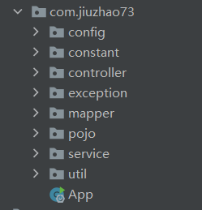
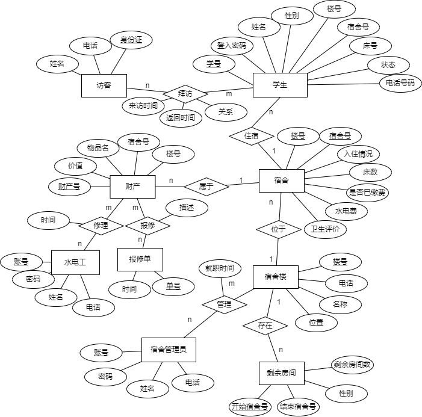
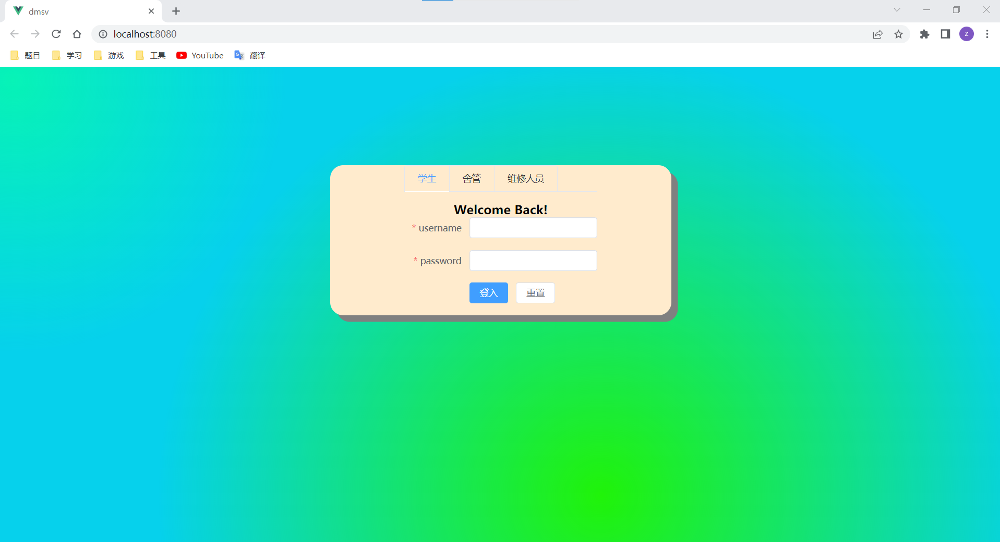
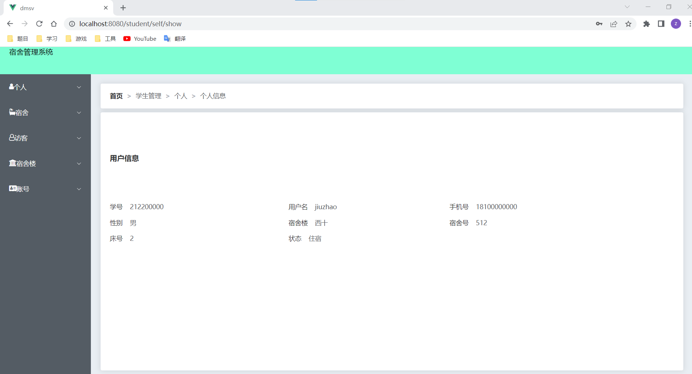
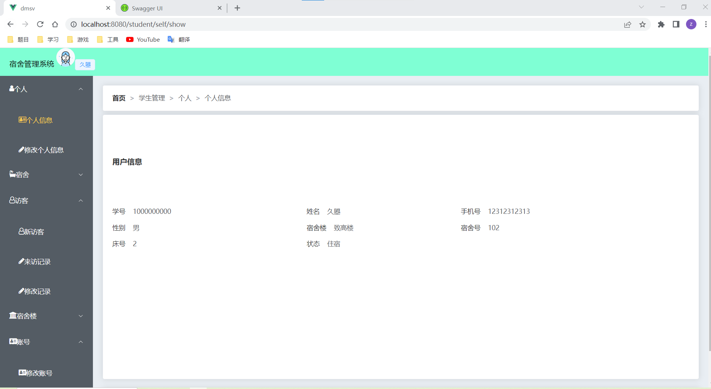
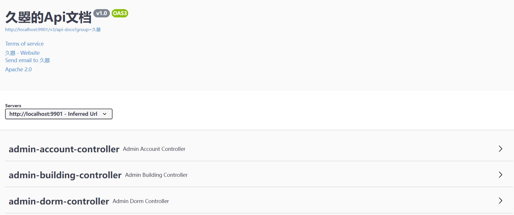

# DMS(宿舍管理系统)

## 1、介绍

基于Spring Boot的宿舍管理系统。

## 2、运行环境

ide使用的是:idea2020.1.1

后端技术栈：

maven3.6.3+jdk8+mysql8.0+springboot2.5+junit+swagger3+Druid

前端技术栈：

Vue3+ElementPlus

## 3、架构

本项目采用MVVM设计模式。

包图：

config:配置

constant:常量包

controller:控制层

exception:异常

mapper:dao

pojo:实体类

service:服务层

util:工具包

## 4、数据库设计

本系统关系较复杂：有13个表

ER:

注：宿舍床位是否空缺用2进制表示。例如，一号床位有人，入住情况字段最低位为1，二号床位无人，入住情况为0，则改宿舍入住情况最终为1。

## 5、功能介绍

学生：拥有查询功能没有修改宿舍功能等。

舍管：可以修改学生信息，但是不是删除该学生。

水电工：可以进行维修。

## 6、运行截图

主页：

登入后界面：

报修页面：

## 7、测试

只进行一点单元测试和接口测试

单元测试在：test包

swagger：http://localhost:9901/swagger-ui/index.html#/

## 8、联系方式

欢迎联系，有空就回。

QQ:2636211752

Email:www.2636211752@qq.com
